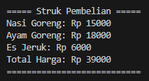

# Project-UAS

## Profil
| Variable | Isi |
| -------- | --- |
| **Nama** | Intan Virginia Aulia Putri |
| **NIM** | 312310657 |
| **Kelas** | TI.23.A.6 |
| **Mata Kuliah** | Bahasa Pemrograman |
| **Link vidio Penjelasan** | https://youtu.be/JPookoV-kI8?si=9h4M9rgHWoWRDmLv |

# UAS

#### Buatlah program kasir di sebuah kantin, dengan kondisi berikut:
- List opsi pilihan makanan/minuman dan aksi, bisa menggunakan
format dictionary
- Program harus meminta input pilihan makanan dari pengguna
- Program harus menghitung total harga makanan yang dipesan
- Program harus menampilkan struk pembelian

### 1. List opsi pilihan makanan/minuman dan aksi, bisa menggunakan format dictionary `menu`

``` Python
menu = {
    "Nasi Goreng": 15000,
    "Mie Goreng": 12000,
    "Ayam Goreng": 18000,
    "Es Teh": 5000,
    "Es Jeruk": 6000,
    "Air Mineral": 3000
}

def tampilkan_menu():
    print("Menu Makanan/Minuman:")
    for item, harga in menu.items():
        print(f"{item}: Rp {harga}")

def hitung_total(hitungan):
    total = sum(hitungan.values())
    return total

def tampilkan_struk(pesanan, total_harga):
    print("\n===== Struk Pembelian =====")
    for item, harga in pesanan.items():
        print(f"{item}: Rp {harga}")
    print(f"Total Harga: Rp {total_harga}")
    print("===========================\n")
```

### Penjelasan
- Menu Awal: mencakup beberapa item makanan/minuman beserta harganya. Didefinisikan dalam dictionary `menu`.
- Fungsi `tampilkan_menu()`: digunakan untuk menampilkan menu makanan/minuman beserta harganya ke layar.
- Fungsi `hitung_total()`: menghitung total harga dari pesanan yang diberikan sebagai argumen.
- Fungsi `tampilkan_struk()`: menampilkan struk pembelian berdasarkan pesanan yang telah dibuat dan total harga.

### 2. Program harus meminta input pilihan makanan dari pengguna

``` Python
def main():
    pesanan = {}
    lanjut = True

    tampilkan_menu()

    while lanjut:
        pilihan = input("Pilih menu (atau ketik 'selesai' untuk selesai): ")
        if pilihan.lower() == 'selesai':
            lanjut = False
        elif pilihan in menu:
            if pilihan in pesanan:
                pesanan[pilihan] += menu[pilihan]
            else:
                pesanan[pilihan] = menu[pilihan]
            print(f"{pilihan} telah ditambahkan ke dalam pesanan.")
        else:
            print("Menu tidak tersedia.")
```

### Penjelasan
- Fungsi `tampilkan_menu()` dipanggil di awal untuk menampilkan menu makanan/minuman beserta harganya ke layar.
- Sebuah loop `while` digunakan untuk terus meminta pengguna untuk memilih item dari menu sampai pengguna ingin mengakhiri pesanan dengan mengetikkan 'selesai'.
Setiap kali dalam loop, pengguna diminta untuk memasukkan pilihan mereka.
- Input pengguna diperiksa:
- Jika input adalah 'selesai', loop dihentikan dengan mengubah variabel `lanjut` menjadi `False`.
- Jika input ada dalam menu, item tersebut ditambahkan ke dalam `pesanan`.
- Jika input tidak ada dalam menu, pesan kesalahan ditampilkan.

#### Tampilan output `tampilkan_menu()` :


### 3. Program harus menghitung total harga makanan yang dipesan, dan Program harus menampilkan struk pembelian

``` Python
    total_harga = hitung_total(pesanan)
    tampilkan_struk(pesanan, total_harga)

if __name__ == "__main__":
    main()
```

### Penjelasan
- Setelah pengguna selesai dengan pesanan, total harga dari pesanan dihitung menggunakan fungsi `hitung_total()`, dengan menggunakan `pesanan` sebagai argumen.
- Fungsi `tampilkan_struk()` dipanggil untuk menampilkan struk pembelian berdasarkan pesanan yang telah dibuat dan total harga yang dihitung.

#### Tampilan output `hitung_total()` dan `tampilkan_struk()` :

